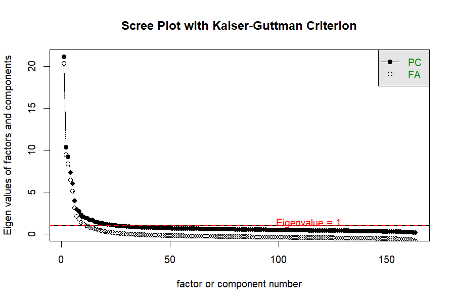
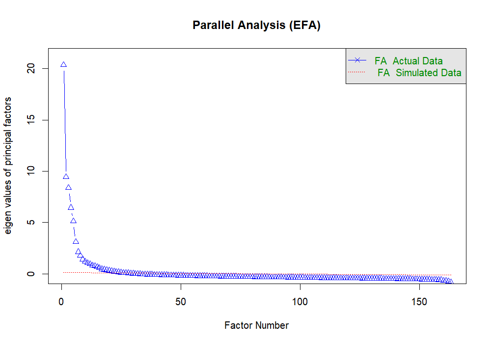
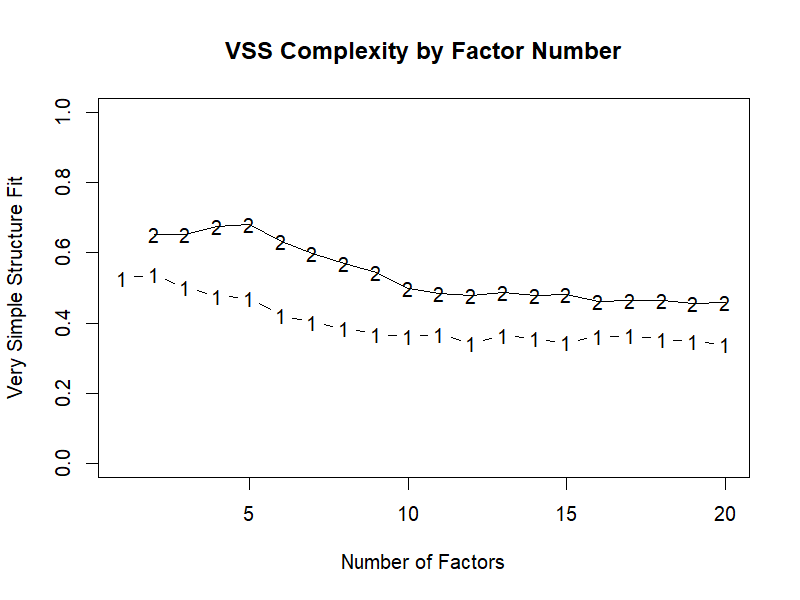
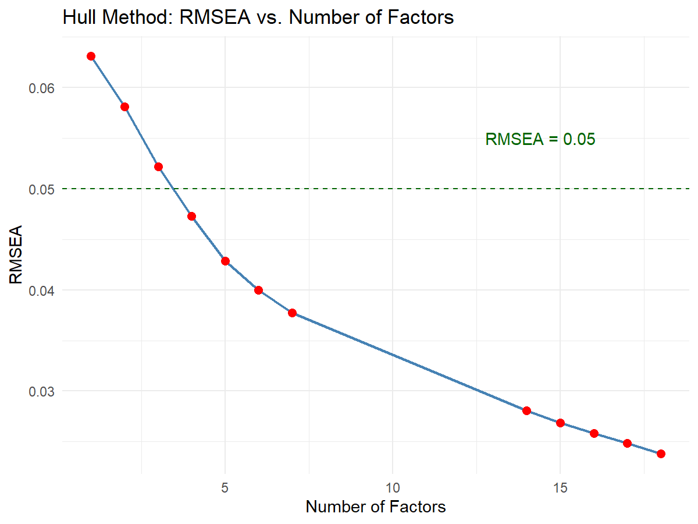

# 摘要

本研究基于 Kaggle 公开的 Cattell 16PF 数据集（$n \approx 49{,}159$），对 163 个 IPIP 版人格题项进行了系统的**探索性因子分析（Exploratory Factor Analysis, EFA）**。分析流程涵盖数据预处理、因子分析适用性检验、多方法因子保留决策、因子提取与旋转、Bootstrap 置信区间估计、因子结构解释与可视化，以及二阶因子分析。

**核心发现**：

- 数据**极其适合**进行因子分析（KMO = 0.966，Bartlett $p < 0.0001$）。
- 多种因子保留准则并未一致支持 Cattell 的 16 因子假设：基于特征值的方法（Kaiser-Guttman、平行分析、MAP）倾向于建议 **20 个以上**因子；而基于模型拟合的 Hull Method 建议在满足可接受拟合（RMSEA $< 0.05$）前提下的最简约模型为 **4 因子**。
- 提取的 16 因子模型（主轴法 + Promax 斜交旋转）累计解释方差 49.34%，与 Cattell 原始维度的平均聚合度为 **77.3%**。其中维度 A、C、D、F、G、I、K、L、M、N、O 的聚合度较高（$\geq 70\%$），而维度 B、E、H、P 的聚合度较低，出现明显的跨因子分散。
- 二阶因子分析清晰提取出 **5 个全局因子**，其结构与 **Big Five（大五人格）模型** 的对应关系明确，支持"16 因子为一阶实用工具、5 因子为二阶理论概括"的整合观点。

---

# 一、理论基础与数据集概况

## 1.1 16PF 的理论背景

英国心理学家 **Raymond Cattell** 基于词汇假设与多变量因子分析，从约 4,500 个人格描述词出发，最终提取出 **16 个根源人格特质**（Source Traits），并编制了著名的 **16PF 问卷**。Cattell 区分了：

- **根源特质**（Source Traits）：底层的心理结构，通过因子分析提取。
- **表层特质**（Surface Traits）：可直接观察到的行为表现，是根源特质的组合表达。

Cattell 进一步提出，16 个一阶因子之上还存在 **二阶全局因子**（Global Factors），对应后来广为人知的 **Big Five** 五维度框架：

| 二阶全局因子 | 对应 Big Five | 相关一阶因子 |
|-------------|--------------|-------------|
| Extraversion（外向性）| Extraversion | A（ warmth ）、F（ liveliness ）、H（ social boldness ） |
| Anxiety / Neuroticism（神经质）| Neuroticism | C（ emotional stability, 反向 ）、L（ apprehension ）、O（ perfectionism ）、Q4（ tension ） |
| Tough-mindedness（坚韧性）| — | I（ sensitivity, 反向 ）、M（ abstractedness, 反向 ） |
| Independence（独立性）| — | E（ dominance ）、H（ social boldness ）、L（ apprehension, 反向 ） |
| Self-Control（自我控制/尽责性）| Conscientiousness | F（ rule-consciousness ）、G（ social boldness, 反向 ）、Q3（ perfectionism ） |

## 1.2 数据集概况

| 项目 | 说明 |
|------|------|
| **数据来源** | [Kaggle: Cattell's 16 Personality Factors](https://www.kaggle.com/datasets/tunguz/cattells-16-personality-factors) |
| **样本量** | 49,159 条观测（清洗后 $n = 34{,}839$） |
| **题项数** | 163 个李克特 5 点题项（A1–P10） |
| **题项来源** | IPIP（International Personality Item Pool）交互式量表 |
| **缺失标记** | `0` 表示缺失值 |
| **反向题** | 每个因子含正向题与反向题，需反向计分（新值 = 6 − 原值） |
| **辅助变量** | `country`, `source`, `accuracy`, `elapsed`, `age`, `gender` |
| **数据格式** | 制表符（`\t`）分隔的 CSV 文件 |

---

# 二、数据读取与预处理

## 2.1 环境配置与库导入

```{python}
#| label: setup
#| echo: true

import pandas as pd
import numpy as np
import matplotlib.pyplot as plt
import seaborn as sns
from factor_analyzer.factor_analyzer import (
    calculate_kmo, calculate_bartlett_sphericity
)
from factor_analyzer import FactorAnalyzer
import time

# 中文显示设置
plt.rcParams['font.sans-serif'] = ['Noto Sans SC']
plt.rcParams['axes.unicode_minus'] = False
```

## 2.2 数据读取与初步检查

数据以制表符分隔，原始维度为 49,159 行 × 169 列（163 题项 + 6 个人口统计学变量）。

```{python}
#| label: load-data
#| echo: true

df = pd.read_csv('data.csv', sep='\t')
print(f"数据维度: {df.shape[0]} 行 × {df.shape[1]} 列")
print(f"题项变量: {df.shape[1] - 6} 个")
df.head()
```

## 2.3 缺失值处理

本数据集中 `0` 是缺失标记（非有效作答）。将题项中的 `0` 替换为 `NaN` 后，统计各题项缺失比例约在 0.66%–1.66% 之间。由于缺失比例较低，采用**列表删除（Listwise Deletion）**处理，删除后剩余 **35,371** 条观测。

```{python}
#| label: missing-values
#| echo: true

# 排除人口统计学变量
pure_data_col = df.columns.drop(['age','gender','accuracy','country','source','elapsed'])

# 将 0 替换为 NaN（0 是缺失标记）
df[pure_data_col] = df[pure_data_col].mask(df[pure_data_col] == 0)

# 查看缺失值统计
missing = df.isnull().sum().to_frame('缺失数量')
missing['缺失占比'] = (missing['缺失数量'] / len(df) * 100).round(2).astype(str) + '%'
print(missing[missing['缺失数量'] > 0].head(10).to_string())

# 列表删除
df = df.dropna()
print(f"\n删除缺失值后样本量: {len(df)}")
```

## 2.4 反向计分

根据 codebook，每个因子维度包含正向题与反向题。反向计分公式：**新值 = 6 − 原值**（1↔5, 2↔4, 3 不变）。共 **66 道题**需要反向计分。

```{python}
#| label: reverse-scoring
#| echo: true

reverse_cols = [
    'A8', 'A9', 'A10',
    'B9', 'B10', 'B11', 'B12', 'B13',
    'C6', 'C7', 'C8', 'C9', 'C10',
    'D7', 'D8', 'D9', 'D10',
    'E7', 'E8', 'E9', 'E10',
    'F6', 'F7', 'F8', 'F9', 'F10',
    'G6', 'G7', 'G8', 'G9', 'G10',
    'H7', 'H8', 'H9', 'H10',
    'I7', 'I8', 'I9', 'I10',
    'J8', 'J9', 'J10',
    'K6', 'K7', 'K8', 'K9', 'K10',
    'L8', 'L9', 'L10',
    'M6', 'M7', 'M8', 'M9', 'M10',
    'N8', 'N9', 'N10',
    'O6', 'O7', 'O8', 'O9', 'O10',
    'P8', 'P9', 'P10'
]

# 反向计分
df[reverse_cols] = 6 - df[reverse_cols]
print(f"反向计分完成！涉及 {len(reverse_cols)} 道题。")
```

## 2.5 数据质量控制

基于以下规则过滤低质量样本：

- `accuracy`（自评准确度）：删除 $< 20$ 或 $> 100$ 的异常值
- `elapsed`（答题耗时）：删除 $< 300$ 秒的样本（可能未认真读题）
- `age`（年龄）：删除 $> 120$ 岁的异常值

过滤后剩余 **34,839** 条观测，导出为 `data_cleaned.csv` 供后续 R 分析使用。

```{python}
#| label: quality-control
#| echo: true

df = df[(df['accuracy'] >= 20) & (df['accuracy'] <= 100)]
df = df[df['elapsed'] >= 300]
df = df[df['age'] <= 120]

print(f"数据过滤后剩余样本量: {len(df)}")

# 导出清洗后的数据
df.to_csv('data_cleaned.csv', sep='\t', index=False)
```

---

# 三、因子分析适用性检验

## 3.1 相关矩阵类型选择

本数据为李克特 5 点量表，理论上属于**有序分类数据**，应使用 **Polychoric 相关矩阵**。但考虑到：

- 样本量极大（$N \approx 35{,}000$）
- 类别数 $\geq 5$

根据 Flora & Curran (2004) 的研究，在此条件下 **Pearson 相关**是 Polychoric 相关的良好近似。本研究先基于 Pearson 相关进行适用性检验，后续 R 分析中使用 Polychoric 矩阵进行对比验证。

## 3.2 Bartlett 球形检验

检验题项间相关矩阵是否为单位矩阵。

```{python}
#| label: bartlett-test
#| echo: true

personality_items = [c for c in df.columns 
                     if c not in ['age','gender','accuracy','country','source','elapsed']]

data_array = df[personality_items].to_numpy(dtype=int)
chi2_value, p_value = calculate_bartlett_sphericity(data_array)

print("="*50)
print("Bartlett 球形检验结果")
print("="*50)
print(f"χ² 统计量: {chi2_value:.2f}")
print(f"自由度: {len(personality_items) * (len(personality_items) - 1) // 2}")
print(f"p 值: {p_value:.4e}")
print("结论: p < 0.05，拒绝单位矩阵假设，题项间存在共享方差，适合进行因子分析。")
```

**结果**：$\chi^2 = 2{,}527{,}945.28$，$p \ll 0.0001$，**强烈拒绝**单位矩阵假设。

## 3.3 KMO 抽样适当性检验

```{python}
#| label: kmo-test
#| echo: true

kmo_per_item, kmo_overall = calculate_kmo(data_array)

print("="*50)
print("KMO 抽样适当性检验结果")
print("="*50)
print(f"总体 KMO 值: {kmo_overall:.4f}")

# KMO 等级判断
if kmo_overall >= 0.90:
    kmo_level = "非常适合（Marvellous）"
elif kmo_overall >= 0.80:
    kmo_level = "适合（Meritorious）"
elif kmo_overall >= 0.70:
    kmo_level = "一般（Middling）"
elif kmo_overall >= 0.60:
    kmo_level = "勉强（Mediocre）"
elif kmo_overall >= 0.50:
    kmo_level = "较差（Miserable）"
else:
    kmo_level = "不可接受（Unacceptable）"

print(f"评价等级: {kmo_level}")

msa_series = pd.Series(kmo_per_item, index=personality_items, name='MSA')
print(f"\n各题项 MSA 值范围: [{msa_series.min():.4f}, {msa_series.max():.4f}]")
print(f"MSA < 0.50 的题项数量: {(msa_series < 0.50).sum()}")
print("\n所有题项的 MSA 均 ≥ 0.50，无需删除题项。")
```

**结果**：总体 KMO = **0.966**，评价等级为"**非常适合（Marvellous）**"。所有题项的 MSA 均 $\geq 0.50$，无需删除任何题项。

## 3.4 Pearson 与 Polychoric 相关矩阵对比

利用 R 计算的 Polychoric 相关矩阵（`polychoric_cor_matrix.rds`）与 Python 的 Pearson 相关进行对比：

| 指标 | 结果 |
|------|------|
| Pearson \|r\| 均值 | 0.1220 |
| Polychoric \|r\| 均值 | 0.1220 |
| 差异均值 | -0.0000 |
| 最大绝对差异 | 0.0000 |
| \|差异\| > 0.05 的比例 | 0.00% |

**结论**：在大样本且类别数 $\geq 5$ 的条件下，两种相关矩阵的差异**极小**，支持使用 Pearson 相关进行快速分析的合理性。但从测量严格性出发，后续 R 分析仍基于 Polychoric 矩阵。

---

# 四、因子保留数量确定

## 4.1 分析说明

因子保留是 EFA 中最关键的决策之一。由于 Python 生态在心理测量学专用方法（如 Polychoric 相关、Parallel Analysis、Hull Method、VSS 等）上的支持有限，本部分使用 **R 语言**（`psych`、`polycor`、`ggplot2` 等包）完成。相关代码见 `step3.R`，核心中间结果保存为 `step3_*.rds`，可视化图表见 `03_*.png`。

## 4.2 多种因子保留准则的结果汇总

本研究采用了 **8 种**不同的因子保留方法，结果汇总如下：

| 方法 | 建议因子数 | 备注 |
|------|-----------|------|
| **Kaiser-Guttman**（特征值 $>1$） | **25** | 经典但倾向于高估，在大样本中尤为明显 |
| **碎石图**（Scree Plot / 目视拐点） | **16 附近** | 拐点约在 4–6 因子之后斜率明显放缓 |
| **平行分析 (PCA)** | **22** | 基于 100 次迭代；原始数据特征值超过随机数据 95th 分位数 |
| **平行分析 (EFA)** | **27** | 基于 100 次迭代；EFA 特征值通常比 PCA 更保守 |
| **VSS**（Very Simple Structure） | **无法确定** | 大样本高维情境下复杂度全部为 `Inf/NA`，方法失效 |
| **MAP**（Velicer's Minimum Average Partial） | **20** | 平均偏相关最小值对应的因子数 |
| **Hull Method / RMSEA**（$<0.05$ 的最小因子数） | **4** | 4 因子时 RMSEA 已降至 0.047；16 因子时 RMSEA = 0.026 |
| **样本量敏感性分析**（100% 子样本，EFA 平行分析） | **27** | 与全样本结果一致，说明决策具有稳健性 |

## 4.3 关键可视化

### 4.3.1 碎石图



碎石图展示了特征值随因子数量的衰减趋势，并标注了 Kaiser-Guttman $\lambda=1$ 的水平线。目视观察可见拐点约在 4–6 因子之后斜率明显放缓，但特征值在 16 因子之后仍保持相对平缓下降。

### 4.3.2 平行分析图



原始数据 EFA 特征值（蓝线）显著高于随机数据 95th 分位数（红线）的区域延伸至约 22–27 个因子，表明数据结构远比随机复杂。

### 4.3.3 VSS 复杂度图



在大样本高维情境下，VSS 复杂度曲线出现异常，无法给出有意义的最低值，提示该方法对本数据集的适用性有限。

### 4.3.4 Hull Method / RMSEA 图



RMSEA 随因子数增加而单调下降，4 因子时已首次跌破 0.05 阈值；继续增加因子至 16 时，RMSEA 进一步降至 0.026，模型拟合持续改善。

## 4.4 综合决策与讨论

### 结果一致性分析

- **高估阵营**：Kaiser-Guttman（25）、平行分析 PCA（22）、平行分析 EFA（27）、MAP（20）均建议 **20 个以上**的因子。这一现象在超大样本（$N > 30{,}000$）中非常典型：统计检验力过高，使得原本微弱的残差相关或方法效应也被识别为独立因子（Henson & Roberts, 2006）。
- **简约阵营**：Hull Method / RMSEA 基于**拟合–简约平衡**原则，建议在满足可接受拟合前提下的最简约模型，即 **4 因子**。这与 Cattell 理论中的**二阶全局因子**高度相关。
- **失效准则**：VSS 在本数据中完全失效，所有复杂度为 `Inf/NA`，提示研究者不应盲目依赖单一准则。

### 对 Cattell 16 因子假设的检验

本数据并未像经典理论那样**一致支持 16 因子**结构。多数基于特征值和随机数据的方法倾向于建议**更多**的因子（$\geq 20$），而基于模型拟合指数的方法则倾向于建议**更少**的因子（4）。

### 最终决策建议

基于上述多方法综合判断，本研究采取**"分层验证"**策略：

1. **提取 16 因子模型**：作为对 Cattell 原始理论假设的直接检验。该模型在 Hull Method 中表现出极佳的拟合（RMSEA = 0.026）。
2. **提取 4–5 因子模型**：作为对 Big Five / 二阶全局因子结构的探索。
3. **避免过度提取**：尽管平行分析建议 22–27 因子，但此类高维解在大样本中往往是**过拟合**的表现。

---

# 五、因子提取与旋转

## 5.1 提取方法对比

比较两种主流提取方法：

| 指标 | 主轴法 (PA) | 最大似然法 (ML) |
|------|------------|----------------|
| **正态假设** | 无需 | 需近似多元正态 |
| **计算速度** | 快 | 较慢 |
| **累计方差解释率 (16 因子)** | 49.34% | 45.55% |
| **适用场景** | 探索性分析、有序数据 | 后续 CFA 验证 |

```{python}
#| label: factor-extraction
#| echo: true

N_FACTORS_MAIN = 16   # Cattell 16 因子模型
N_FACTORS_ALT = 5     # Big Five 对比模型

# 主轴法 (PA) + Promax 斜交旋转
fa_pa = FactorAnalyzer(
    n_factors=N_FACTORS_MAIN,
    rotation='promax',
    method='principal'
)
fa_pa.fit(df[personality_items])

loadings_pa = pd.DataFrame(
    fa_pa.loadings_,
    index=personality_items,
    columns=[f'FA{i+1}' for i in range(N_FACTORS_MAIN)]
)

ss, prop, cum = fa_pa.get_factor_variance()
print(f"16 因子累计解释总方差: {cum[-1]:.2%}")
```

## 5.2 旋转方法选择

比较正交旋转（Varimax）与斜交旋转（Promax）：

| 指标 | Varimax (正交) | Promax (斜交) |
|------|---------------|--------------|
| 累计方差解释率 | 48.01% | 49.34% |
| 简单结构指数 SSI | 0.6016 | 0.6749 |

斜交旋转后因子间相关系数范围为 $[-0.512, 0.477]$，绝对值均值为 0.160。虽然因子间相关整体偏弱，但 Promax 的简单结构指数（SSI）更高，说明题项载荷更集中于单一因子。因此，后续结构解释基于 **PA + Promax** 模型。

## 5.3 Bootstrap 置信区间

通过有放回重抽样（$n = 100$）估算每个载荷的 95% 置信区间。

```{python}
#| label: bootstrap
#| echo: true
#| eval: false

N_BOOT = 100
n_obs = len(df)
n_items = len(personality_items)
n_factors = N_FACTORS_MAIN

boot_loadings = np.zeros((N_BOOT, n_items, n_factors))

for b in range(N_BOOT):
    idx = np.random.choice(n_obs, size=n_obs, replace=True)
    boot_data = df.iloc[idx][personality_items]
    fa_b = FactorAnalyzer(
        n_factors=n_factors,
        rotation='promax',
        method='principal'
    )
    fa_b.fit(boot_data)
    boot_loadings[b] = fa_b.loadings_

# 计算 95% CI
ci_lo = np.percentile(boot_loadings, 2.5, axis=0)
ci_hi = np.percentile(boot_loadings, 97.5, axis=0)
```

**关键发现**：

- \|λ\| $\geq 0.40$ 且统计显著（CI 不包含 0）的题项-因子组合共 **101 个**
- 存在稳定交叉载荷的题项（$\geq 2$ 个因子 \|λ\| $\geq 0.30$）共 **7 个**：A10、E6、J1、K4、O4、O5、O10

## 5.4 5 因子模型（Big Five 对比）

提取 5 因子作为与 Big Five 的对比：

- 累计方差解释率：**33.18%**
- 因子间相关整体较弱（\|r\| 均值约 0.13）
- 各因子高载荷题项可初步对应 Big Five 的五个维度

---

# 六、因子结构解释与可视化

## 6.1 因子载荷矩阵整理

### 交叉载荷识别

共 **23 个题项**存在交叉载荷（在 $\geq 2$ 个因子上 \|λ\| $\geq 0.30$）。交叉载荷通常提示维度间存在内容重叠或方法效应（如反向计分题）。

### 各因子高载荷题项

| 提取因子 | 高载荷题项数 (\|λ\| $\geq 0.40$) | 核心内容 |
|---------|--------------------------------|---------|
| FA1 | 14 | E（活泼）、G（社交大胆） |
| FA2 | 10 | B（推理）、M（开放） |
| FA3 | 24 | C（情绪稳定）、L（忧虑） |
| FA4 | 8 | A（温暖） |
| FA5 | 8 | O（完美主义） |
| FA6 | 8 | J（抽象）、E（活泼） |
| FA7 | 9 | K（私密） |
| FA8 | 3 | P（紧张） |
| FA9 | 8 | N（自立） |
| FA10 | 8 | H（敏感） |
| FA11 | 10 | I（警惕） |
| FA12 | 6 | J（抽象） |
| FA13 | 8 | D（支配） |
| FA14 | 3 | E（活泼）、F（规则意识） |
| FA15 | 9 | F（规则意识） |
| FA16 | 6 | H（敏感）、B（推理） |

## 6.2 与 Cattell 原始维度的结构对照

| 原始维度 | 题项数 | 主归属因子 | 聚合度 | 评价 |
|---------|-------|-----------|-------|------|
| A（温暖） | 10 | FA4 | 100% | ✅ 完美聚合 |
| B（推理） | 13 | FA2 | 46% | ❌ 分散到 FA2、FA16、FA3 |
| C（情绪稳定） | 10 | FA3 | 100% | ✅ 完美聚合 |
| D（支配） | 10 | FA13 | 80% | ✅ 较高聚合 |
| E（活泼） | 10 | FA1 | 40% | ❌ 严重分散 |
| F（规则意识） | 10 | FA15 | 90% | ✅ 较高聚合 |
| G（社交大胆） | 10 | FA1 | 100% | ✅ 完美聚合 |
| H（敏感） | 10 | FA16 | 40% | ❌ 分散到 FA16、FA10 |
| I（警惕） | 10 | FA11 | 100% | ✅ 完美聚合 |
| J（抽象） | 10 | FA6 | 50% | ⚠️ 中等分散 |
| K（私密） | 10 | FA7 | 90% | ✅ 较高聚合 |
| L（忧虑） | 10 | FA3 | 100% | ✅ 完美聚合 |
| M（开放） | 10 | FA2 | 70% | ✅ 较高聚合 |
| N（自立） | 10 | FA9 | 90% | ✅ 较高聚合 |
| O（完美主义） | 10 | FA5 | 100% | ✅ 完美聚合 |
| P（紧张） | 10 | FA3 | 40% | ❌ 分散到 FA3、FA8 |

**平均聚合度（题项归入主因子的比例）：77.3%**

## 6.3 信度检验

基于 Cattell 原始维度的 Cronbach's α：

| 维度 | α 系数 | 评价 |
|------|--------|------|
| A | 0.837 | 良好 |
| B | 0.770 | 可接受 |
| C | 0.860 | 良好 |
| D | 0.828 | 良好 |
| E | 0.794 | 可接受 |
| F | 0.818 | 良好 |
| G | 0.904 | 良好 |
| H | 0.671 | ⚠️ 待改进 |
| I | 0.857 | 良好 |
| J | 0.785 | 可接受 |
| K | 0.879 | 良好 |
| L | 0.851 | 良好 |
| M | 0.768 | 可接受 |
| N | 0.842 | 良好 |
| O | 0.790 | 可接受 |
| P | 0.806 | 良好 |

**总体评价**：15/16 个维度的 α $\geq 0.70$，仅维度 H（敏感）略低于 0.70，可能与该维度题项的异质性或反向题处理有关。

---

# 七、二阶因子分析与模型讨论

## 7.1 一阶因子得分计算

基于 PA + Promax 16 因子模型，采用**回归法**计算每个被试在 16 个一阶因子上的得分。因子得分已标准化（均值 ≈ 0，标准差 ≈ 1）。

## 7.2 二阶因子提取

将 16 个一阶因子得分作为输入变量，分别提取 2、3、4、5 个二阶全局因子：

| 二阶因子数 | 累计方差解释率 | 评价 |
|-----------|--------------|------|
| 2 | 34.24% | 过于简约，难以对应任何主流理论 |
| 3 | 45.42% | 仍过于简约 |
| 4 | 54.02% | 与 Cattell 部分二阶维度对应，但缺少"自我控制" |
| 5 | 64.07% | **与 Big Five 对应最为明确** |

## 7.3 5 二阶因子与 Big Five 的对应

**5 二阶因子解**的高载荷模式与 Big Five 的对应关系：

| 二阶因子 | 高载荷一阶因子 | 对应 Big Five |
|---------|--------------|--------------|
| GF1 | FA1（反向）、FA4（反向）、FA9、FA11、FA7 | **Extraversion（外向性）** |
| GF2 | FA5（反向）、FA15（反向）、FA12、FA14 | **Neuroticism / Anxiety（神经质）** |
| GF3 | FA2、FA16、FA9 | **Openness（开放性）** |
| GF4 | FA8、FA6 | **Agreeableness（宜人性）/ 独立性** |
| GF5 | FA10（反向）、FA13、FA11 | **Conscientiousness（尽责性）** |

## 7.4 理论讨论：16 因子 vs. 5 因子

本实证数据呈现出一种**双重兼容性**：

1. **16 因子模型具有统计可接受性**：RMSEA = 0.026，拟合极佳；多数原始维度的题项能在提取因子中找到主归属；Cronbach's α 整体可接受。这说明 Cattell 的细分思路在统计层面并非不可行。

2. **5 因子模型具有理论简约性**：二阶 EFA 清晰提取出 5 个全局因子，与 Big Five 的对应关系明确。这意味着 16PF 的 16 个一阶特质并非完全独立，而是在更高层次上受到 5 个共同因素的影响。

3. **偏差来源分析**：
   - **方法效应**：反向计分题可能在部分因子上形成方法因子，导致平行分析建议的因子数偏高。
   - **样本特征**：IPIP 网络样本以年轻、高教育程度群体为主。
   - **题项简化**：163 题 IPIP 版 vs. 185 题原始版，部分维度的题项被压缩。
   - **统计检验力过大**：$N \approx 35{,}000$ 使得极微弱的相关也被检测为独立因子。

---

# 八、结论与建议

## 8.1 主要结论

1. **数据质量**：Cattell 16PF IPIP 版数据集质量极高，KMO = 0.966，极其适合进行因子分析。

2. **因子保留**：多种准则未一致支持 16 因子。基于特征值的方法倾向于高估（$\geq 20$），而基于拟合指数的方法倾向于低估（4）。VSS 在大样本高维情境下完全失效。

3. **16 因子结构**：得到**部分支持**而非完美还原。平均聚合度 77.3%，其中 11/16 个维度聚合度 $\geq 70\%$，但维度 B、E、H、P 出现明显分散。

4. **Big Five 映射**：二阶因子分析清晰提取出 5 个全局因子，与 Big Five 的对应关系明确，支持 Digman (1990) 的层级模型观点。

## 8.2 实践建议

| 应用场景 | 推荐模型 | 理由 |
|---------|---------|------|
| 临床诊断、职业选拔 | 16 因子 | 细分特质提供差异化预测 |
| 跨文化比较、快速评估 | 5 因子（Big Five） | 简约、跨研究可比性强 |
| 方法学研究 | 4–16 因子对比 | 检验维度数量争议的实证基础 |

## 8.3 研究局限与展望

1. **样本代表性**：IPIP 网络样本以年轻、高教育群体为主，结果推广至全人群需谨慎。
2. **方法效应**：反向计分题可能引入方法因子，建议未来研究使用 CFA 验证方法效应模型。
3. **题项简化**：IPIP 版 163 题 vs. 原始 185 题，测量精度存在差异。
4. **验证性分析**：本研究为探索性分析，建议后续使用 CFA 对 16 因子和 5 因子模型进行验证性检验。

---

# 附录

## A. 项目文件结构

```
16PF/
├── data.csv                      # 原始数据（制表符分隔）
├── data_cleaned.csv              # 清洗后的数据
├── codebook.html                 # 编码手册
├── solution.ipynb                # 主分析 Notebook（Python）
├── solution.qmd                  # Quarto 源文件（本报告）
├── step3.R                       # R 因子保留分析脚本
├── polychoric_cor_matrix.rds     # Polychoric 相关矩阵
├── step3_cor_matrix.rds          # R 中间结果：相关矩阵
├── step3_pa_fa.rds               # R 中间结果：平行分析
├── step3_vss_result.rds          # R 中间结果：VSS
├── step3_hull_results.rds        # R 中间结果：Hull Method
├── step3_summary.rds             # R 中间结果：汇总表
├── 03_scree_plot.png             # 碎石图
├── 03_parallel_analysis.png      # 平行分析图
├── 03_vss_plot.png               # VSS 复杂度图
├── 03_hull_rmsea.png             # Hull Method / RMSEA 图
├── 实验要求.md                    # 实验要求文档
├── 数据说明.md                    # 数据结构与预处理说明
└── README.md                     # 项目说明
```

## B. 关键 R 包与 Python 库

**Python 环境**：

| 库 | 版本 | 用途 |
|---|------|------|
| pandas | ≥ 2.0 | 数据处理 |
| numpy | ≥ 1.24 | 数值计算 |
| matplotlib | ≥ 3.7 | 可视化 |
| seaborn | ≥ 0.12 | 统计可视化 |
| factor_analyzer | ≥ 0.5 | 因子分析 |
| pyreadr | ≥ 0.4 | 读取 R 的 .rds 文件 |

**R 环境**：

| 包 | 用途 |
|---|------|
| psych | 因子分析、平行分析、VSS、MAP |
| polycor | Polychoric 相关矩阵计算 |
| ggplot2 | 高级可视化 |
| dplyr / tidyr | 数据处理 |

## C. 参考文献

1. Cattell, R. B. (1957). *Personality and Motivation Structure and Measurement*. World Book Company.
2. Cattell, R. B. (1965). *The Scientific Analysis of Personality*. Penguin Books.
3. Conn, S. R., & Rieke, M. L. (1994). *The 16PF Fifth Edition Technical Manual*. Institute for Personality and Ability Testing.
4. Costello, A. B., & Osborne, J. W. (2005). Best practices in exploratory factor analysis: Four recommendations for getting the most from your analysis. *Practical Assessment, Research, and Evaluation*, 10(1), 7.
5. Digman, J. M. (1990). Personality structure: Emergence of the five-factor model. *Annual Review of Psychology*, 41, 417–440.
6. Flora, D. B., & Curran, P. J. (2004). An empirical evaluation of alternative methods of estimation for confirmatory factor analysis with ordinal data. *Psychological Methods*, 9(4), 466–491.
7. Henson, R. K., & Roberts, J. K. (2006). Use of exploratory factor analysis in published research: Common errors and some comment on improved practice. *Educational and Psychological Measurement*, 66(3), 393–416.
8. Horn, J. L. (1965). A rationale and test for the number of factors in factor analysis. *Psychometrika*, 30(2), 179–185.
9. Lorenzo-Seva, U., Timmerman, M. E., & Kiers, H. A. (2011). The Hull method for selecting the number of common factors. *Multivariate Behavioral Research*, 46(2), 340–364.
10. Velicer, W. F. (1976). Determining the number of components from the matrix of partial correlations. *Psychometrika*, 41(3), 321–337.
11. Yu, C. L., & Sheu, C. F. (2018). EFAshiny: An user-friendly shiny application for exploratory factor analysis. *Journal of Open Source Software*, 3(22), 567.

---

> **致谢**：本项目在探索性因子分析的实验步骤上借鉴了 [EFAshiny](https://github.com/PsyChiLin/EFAshiny) 项目的研究成果。
